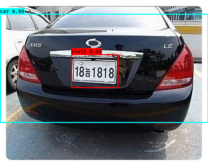

# vehicle recognition

## Introduction
- Vehicle license plate recognition using yolo v3

## Env
- windows
    - CUDA9, cuDNN
- python=3.6
    - keras=2.1.5
    - tensorflow=1.9
    - opencv
    - matplotlib
    - pillow
    - pydot
    - graphviz

## Quick Start
1. Data setting
    1. Download [keras-yolo3](https://github.com/qqwweee/keras-yolo3)
    1. Add ./CarPlate_dataset
    1. Run voc_annotation.py
1. Train
    1. Add ./yolov3.weights [YOLOv3-416 weights](https://pjreddie.com/darknet/yolo/)
    1. Run python convert.py yolov3.cfg yolov3.weights model_data/yolo.h5
    1. Run python train.py
    1. Move result ./logs -> ./model_data/yolo.h5
1. Run
    1. Run python yolo_video.py --image

## Result
그래픽카드 성능이 낮아서 (GTX 1060 3GB) 학습 도중 메모리 용량 초과로 학습을 별로 시키지 못함    

100 epoch, 230개 train 하면 어느정도 인식 가능    

